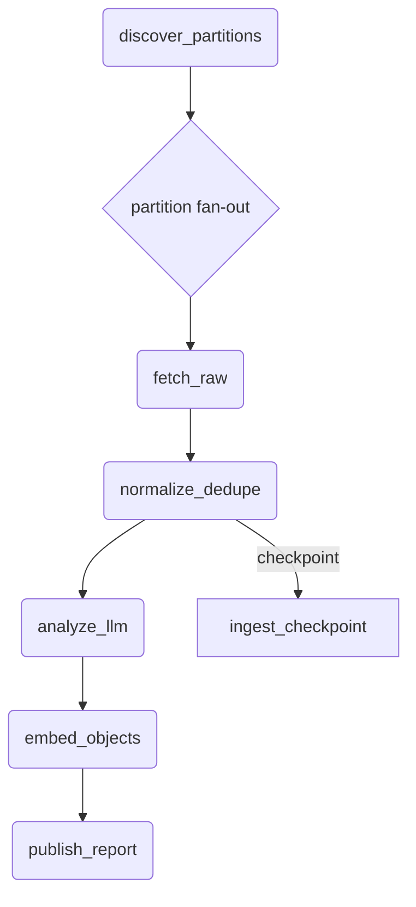

# Airflow-Backed GraphQL Control Plane (Heavy Backfills) PRD

## 1. Executive Summary
- **Motivation**: Existing ingestion jobs cannot cover multi-week, multi-subreddit workloads with strong retry, lineage, and cost controls. Apache Airflow provides partition-aware scheduling, observability, and retry semantics essential for backfills that may run for days.
- **Control vs Execution Plane**: FastAPI/GraphQL remains the self-service surface for submitting runs, monitoring job state, and fetching results. Airflow executes long-running, highly parallel pipelines (scrape → normalize → analyze → embed → report) and reports status back via the shared Postgres job tables.
- **MVP Scope**: Deliver coordinator & worker DAGs capable of 90-day backfills, GraphQL mutations/queries for run management, normalized Postgres + raw S3 layout, pgvector-backed embeddings, and baseline observability/cost guardrails.
- **Later Enhancements**: Advanced RBAC/multi-tenant isolation, adaptive partition sizing via ML heuristics, cross-source ingestion (Twitter, Discord), streaming updates, and automated report publishing workflows.

## 2. Architecture Overview
### 2.1 Textual Flow Diagram
```
[User / Ops UI]
    |
    v
[GraphQL Control Plane]
    |  runBackfill/runScrape mutations
    v
[Airflow REST API]
    |  POST /dags/.../dagRuns (conf)
    v
[Airflow Coordinator DAG]
    |  dynamic mapping per (subreddit×keyword×day)
    v
[Worker Tasks]
  ├─ discover_partitions
  ├─ fetch_raw → write raw S3
  ├─ normalize_dedupe → Postgres posts/comments
  ├─ analyze_llm → Postgres analyses (+ cost tracking)
  ├─ embed_objects → pgvector (optional)
  └─ publish_report → Postgres reports + S3 artifacts

Data Stores:
- S3/MinIO: raw JSONL shards + report artifacts
- Postgres: jobs, checkpoints, normalized entities, analyses, reports
- pgvector: embeddings table (optional external vector DB later)
```

### 2.2 Boundaries
- **GraphQL (control plane)**
  - Owns API schema, job metadata persistence, RBAC, and exposes job/result entities to the UI.
  - Talks to Airflow only via REST; no direct DB coupling.
- **Airflow (execution plane)**
  - Owns scheduling, partition orchestration, retries, rate limiting, and lineage events.
  - Writes normalized data back via shared SQLAlchemy ingestion package to keep schema consistency.

### 2.3 DAG Graph (Mermaid)


## 3. Airflow Design for Heavy Backfills
### 3.1 Coordinator DAG (`reddit_backfill_coordinator`)
- Accepts `topic`, `subreddits[]`, `keywords[]`, `date_range`, `max_concurrency`, `sample_rate`, `cost_cap_cents`.
- Generates daily partitions for each `(subreddit, keyword, date)`. Hot subs can be further sharded by hour or post volume via config (e.g., `shard_size=5k posts`).
- Uses dynamic task mapping / TaskGroup per partition to enqueue child tasks. Stores partition manifest in Postgres for auditing.
- Enforces `max_concurrency` via Airflow pools; partitions beyond the cap wait automatically.

### 3.2 Worker Task Structure (per partition)
1. **`fetch_raw`**
   - Rate-limit aware Reddit client. Token-bucket stored in Redis or Postgres table. Retries with exponential backoff + jitter; respect HTTP 429 windows.
   - Writes JSONL to `s3://bucket/raw/reddit/{subreddit}/{YYYY}/{MM}/{DD}/{keyword}/{shard_id}.jsonl` with metadata header.
2. **`normalize_dedupe`**
   - UPSERT posts/comments keyed by `reddit_id`. Maintains `edited_utc`, `raw_ref` (S3 URI + offset) for provenance.
   - Updates `ingest_checkpoint` with `high_watermark_created_utc` and status (`pending → running → success/failed/partial_success`).
3. **`analyze_llm`**
   - Batch posts/comments (<=2k tokens) with templated prompts. Enforces per-partition `cost_cap_cents`; if exceeded, truncates queue or switches to heuristic summarizer.
   - Writes `analysis` rows with `model`, `model_version`, `fields_json`, `cost_cents`.
4. **`embed_objects` (optional)**
   - Runs when embeddings enabled for the topic. Batches up to `N` embeddings per API call, writes to `embedding` table (pgvector). Supports delayed scheduling if resource constrained.
5. **`publish_report_artifacts`**
   - Aggregates per-partition outputs into topic report sections. Generates Markdown & HTML, writes to S3, and creates `report` rows linking to URIs.

### 3.3 Idempotency & Exactly Once
- Unique constraints on `post.reddit_id` and `comment.reddit_id` ensure dedupe. UPSERT uses `ON CONFLICT DO UPDATE` to refresh scores, edited timestamps, and metadata.
- `ingest_checkpoint(subreddit, keyword, partition_date, high_watermark_created_utc, last_run_id, status, retries, error)` enables resume/retry without duplication.
- `analysis` includes `model_version` & `run_id` to allow reprocessing while retaining history.
- `raw_ref` + checksums allow verifying data integrity when re-running partitions.

### 3.4 Late Arrivals & Edits
- Coordinator optionally replays `late_arrival_window_days` (default 2) before current partition. Each rerun compares existing `edited_utc` or `last_seen` to detect changes.
- Soft-delete table `tombstones(post_reddit_id, deleted_at, source)` records removals or banned content for downstream filtering.

### 3.5 Concurrency & Rate Limits
- Airflow pools: `reddit_fetch_pool`, `llm_pool`, `embedding_pool` with tenant/topic sub-pools if needed.
- Token-bucket service (Redis or DB) stores per-credential allowance; tasks acquire tokens before API calls.
- Backpressure logic reduces concurrency when repeated rate-limit errors occur (tracked via XCom or Airflow Variables).

### 3.6 Retry & Alerting
- Default `fetch_raw` retries: 5 with jitter; `analyze_llm`: 3; `embed_objects`: 2 (LLM costs). Each task marks partition `partial_success` if it exhausts retries but outputs partial data.
- SLA monitors: partitions exceeding `partition_sla_minutes` raise Airflow SLA miss; Notifies Slack/email/webhook with job metadata.
- Failure notifications include topic, partition key, error summary, and remediation link.

### 3.7 Cost & Safety Controls
- Per-run `cost_cap_cents` enforced at coordinator; partitions stop LLM/embedding steps when sum exceeds cap.
- Hard limits on posts/comments per partition (e.g., 5k posts, 50k comments) to cap compute.
- Thread truncation (keep top N comments by score) prior to LLM inference.

## 4. Data Model & Storage
### 4.1 Postgres Tables (new or extended)
- `job(id UUID PK, type TEXT, params_json JSONB, status TEXT, created_at, started_at, finished_at, error_text, external_ref_json, airflow_run_id)`
- `ingest_checkpoint(id BIGSERIAL PK, topic TEXT, subreddit TEXT, keyword TEXT, partition_date DATE, status TEXT, high_watermark TIMESTAMPTZ, last_run_id UUID, retries INT, error TEXT, updated_at)`
- `post(reddit_id TEXT PK, topic TEXT, subreddit TEXT, title TEXT, body TEXT, author TEXT, created_utc TIMESTAMPTZ, edited_utc TIMESTAMPTZ, url TEXT, score INT, raw_ref TEXT, inserted_at, updated_at)`
- `comment(reddit_id TEXT PK, post_reddit_id TEXT FK post.reddit_id, body TEXT, author TEXT, created_utc, edited_utc, score INT, raw_ref TEXT, inserted_at, updated_at)`
- `analysis(id BIGSERIAL PK, post_reddit_id TEXT FK, run_id UUID, sentiment TEXT, summary TEXT, fields_json JSONB, model TEXT, model_version TEXT, cost_cents INT, created_at)`
- `embedding(id BIGSERIAL PK, object_type TEXT, object_id TEXT, dim INT, vector VECTOR(dim), model TEXT, model_version TEXT, created_at)`
- `report(id BIGSERIAL PK, run_id UUID, topic TEXT, format TEXT CHECK IN ('md','html','pdf'), uri TEXT, created_at)`
- Supporting tables: `job_events`, `tombstones`, `llm_spend_ledger`.

### 4.2 Raw Zone Layout (S3/MinIO)
```
raw/
  reddit/
    {subreddit}/
      {YYYY}/{MM}/{DD}/
        {keyword}/
          shard={partition_seq}/batch-{timestamp}.jsonl
```
Each JSONL line: `{ "reddit_id": "t3_abc", "kind": "post", "payload": {...}, "fetched_at": "..." }`.

### 4.3 Provenance & Lineage
- `raw_ref` stores `s3://...#offset` for each normalized row.
- `analysis.model_version` & `embedding.model_version` allow diffing outputs across reruns.
- `report.run_id` links final report to upstream job; `job.external_ref_json` stores Airflow dag/task metadata for auditing.

## 5. GraphQL Additions (Control Plane)
### 5.1 Schema Changes (excerpt)
```graphql
type Job {
  id: ID!
  type: JobType!
  status: JobStatus!
  progress: Float
  startedAt: DateTime
  finishedAt: DateTime
  error: String
  params: JSON!
}

type Mutation {
  runBackfill(input: RunBackfillInput!): Job!
  runScrape(input: RunScrapeInput!): Job!
  reanalyze(input: ReanalyzeInput!): Job!
}

type Query {
  job(id: ID!): Job
  jobs(filter: JobFilter): [Job!]!
  posts(filter: PostFilter): [Post!]!
  reports(filter: ReportFilter): [Report!]!
}
```

### 5.2 Example GraphQL Mutation
```graphql
mutation Backfill90Days {
  runBackfill(
    input: {
      topic: "NIL-Football"
      subreddits: ["CFB", "collegefootball", "OhioState"]
      keywords: ["NIL", "sponsorship"]
      dateRange: { from: "2024-06-01", to: "2024-08-30" }
      maxConcurrency: 30
      sampleRate: 0.7
      costCapCents: 50000
    }
  ) {
    id
    type
    status
    params
  }
}
```

### 5.3 Status Mapping & Access Control
- GraphQL derives job status from Postgres `job.status`, which is synchronized via Airflow callbacks. Dag states (`running`, `queued`, `failed`, `success`, `canceled`) map to GraphQL enum.
- Multi-tenant guard: topics and jobs scoped to organization; resolvers enforce `org_id` filter and raise authorization errors otherwise.

## 6. Backfill Strategy & Controls
- **Partition Planner**: Builds list of `(subreddit, keyword, day)` partitions, skipping those with `ingest_checkpoint.status = 'success'` unless `force=true`.
- **Sampling**: `sampleRate` randomly subsamples posts in high-volume partitions; `top_n_by_score` optional filter for `runScrape`.
- **Throttling**: Coordinator ensures `active_partitions <= maxConcurrency`. Additional per-subreddit concurrency (default 3) prevents hammering single communities.
- **Reprocessing**: Setting `analysis_version` or `model_version` greater than stored value triggers `reanalyze` DAG which reuses normalized posts/comments instead of refetching raw.
- **Data Quality Gates**: Validate `body` length, remove NSFW or personal info before LLM; drop partitions with <X posts to avoid wasted cycles.

## 7. Observability & Operations
- **Metrics**
  - `backfill_partitions_planned/running/succeeded/failed`
  - `records_fetched`, `records_deduped`
  - `llm_tokens`, `llm_cost_cents`, `embedding_cost_cents`
  - `task_retry_count`, `rate_limit_events`
- **Logging**: Structured logs include `run_id`, `partition_key`, `task`, `attempt`, `duration_ms`, `cost_cents`. Logs shipped to ELK/CloudWatch.
- **Lineage**: Document lineage raw→normalized→analysis→embedding→report; link to DAG IDs, job IDs, and S3 URIs in run metadata for reproducibility.
- **Dashboards**: Grafana board showing partitions by status, runtime percentile, API error rates, spend vs cap; Airflow UI remains fallback.

## 8. Security & Compliance
- Store Reddit + LLM credentials in Vault/Secrets Manager; Airflow connections reference secret IDs only.
- Enforce Reddit ToS: abide by rate limits, respect banned subreddits, honor API usage guidelines.
- Apply PII scrub before LLM (regex + policy engine). Keep NSFW flag and apply content filters downstream.
- Data retention: raw JSON retained 90 days by default; normalized tables adhere to compliance policy (soft-delete after 1 year). Provide deletion workflow keyed by topic or run.

## 9. Open Questions
1. What topic taxonomy and report templates are required for launch (static vs dynamic sections)?
2. Do stakeholders need explicit SLA (e.g., "90-day backfill must complete in <48h")?
3. Are multi-tenant orgs part of MVP or future (impacts RBAC/pooling)?
4. Initial vector store: pgvector acceptable or should we plan for Qdrant/Pinecone from day one?
5. Cost caps: per-run only, or also per-tenant monthly budgets exposed in UI?

## 10. Acceptance Criteria
- **GraphQL**
  - Mutations (`runBackfill`, `runScrape`, `reanalyze`) and queries (`job`, `jobs`, `posts`, `reports`) functional with job persistence & status mapping.
  - Status queries rely on Postgres, not direct Airflow calls.
- **Airflow**
  - Coordinator + worker DAGs accept large date ranges, dynamically partition work, and handle retries/idempotency.
  - Rate limiting, pools, and cost controls enforced per partition.
- **Storage**
  - Raw S3 layout created; Postgres schemas/migrations applied with indexes/constraints.
  - Embedding table available (pgvector) with indexes; optional external store pluggable.
- **Backfills**
  - Demonstrated 90-day backfill across ≥10 subreddits × ≥10 keywords within configured concurrency, producing deduplicated posts/comments/analyses.
- **Observability**
  - Metrics exported + dashboards/alerts configured; ability to identify slow/failed partitions and view LLM spend per run.
- **Documentation**
  - This PRD + runbooks include textual diagrams, example Airflow `conf`, and sample GraphQL requests.

## Appendix
### Example Airflow `dag_run` Payload
```json
{
  "conf": {
    "job_id": "c5d9c2dc-1d39-4d47-8e5c-5eae991d8f0a",
    "topic": "NIL-Football",
    "subreddits": ["CFB", "collegefootball", "OhioState"],
    "keywords": ["NIL", "sponsorship"],
    "date_range": {"from": "2024-06-01", "to": "2024-08-30"},
    "max_concurrency": 30,
    "sample_rate": 0.7,
    "cost_cap_cents": 50000,
    "late_arrival_window_days": 2,
    "force": false
  }
}
```

### Example Job Status Query
```graphql
query JobStatus($id: ID!) {
  job(id: $id) {
    id
    type
    status
    progress
    startedAt
    finishedAt
    error
    params
  }
}
```
