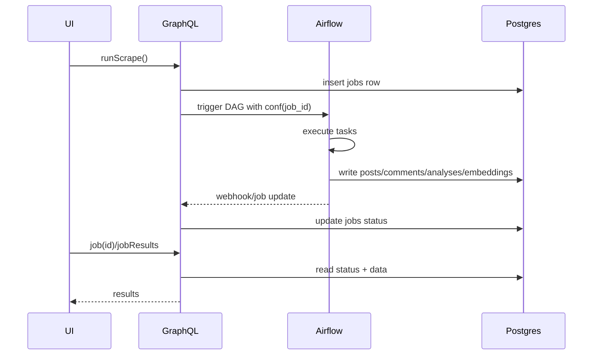

# Airflow-Backed GraphQL Orchestration PRD

## Executive Summary
We will extend the FastAPI GraphQL control plane to orchestrate asynchronous Reddit ingestion, LLM analysis, and embedding workflows that execute inside Apache Airflow. GraphQL mutations submit jobs and persist intent in Postgres, while Airflow DAGs perform scraping, enrichment, and vectorization tasks, pushing results back into shared data stores. This PRD defines the end-to-end architecture, schema additions, operational guarantees, and future roadmap required to ship a reliable, observable orchestration layer.

## Architecture Overview
- **Control plane**: FastAPI + Strawberry/Ariadne GraphQL API handles user authentication, job submission, and status queries. It owns the canonical `jobs` table.
- **Execution plane**: Airflow scheduler + workers run DAGs that pull configs from DAG `conf` payloads, perform IO-bound scraping/analysis, and write structured outputs to Postgres + vector store.
- **Storage**: Postgres stores raw Reddit artifacts, analyses, embeddings metadata; pgvector (or external vector DB) stores dense vectors for similarity search.
- **Observability**: Job lifecycle mirrored between Airflow states and `jobs` table, surfaced through GraphQL queries and internal dashboards.

### Textual Architecture Diagram
```
[User/UI]
    |
    v
[GraphQL Control Plane]
    |  (1) mutation: runScrape/ reanalyze
    v
[Airflow REST API / Trigger DAG]
    |
    v
[Airflow Scheduler -> Workers]
    |  (scrape → normalize → analyze → embed)
    v
[Postgres + Vector Store]
    ^
    |  (status + data fetch)
[GraphQL Queries]
```

### Component Roles
- GraphQL ensures jobs are authenticated, validated, and deduplicated.
- Airflow DAGs provide retry/backoff, dependency order, and scheduling.
- Storage + vector indexes serve downstream UI search and analytics.

## System Components
### GraphQL Layer (FastAPI + Strawberry/Ariadne)
- **Mutations**: `runScrape(subreddits, keywords, depth, priority)`, `reanalyze(jobId, llmProfile)`, `reembed(postIds, model)`, `cancelJob(id)`.
- **Queries**: `job(id)`, `jobs(status, limit, ownerId)`, `jobResults(jobId, entityType)`, `pipelineDefinitions`.
- **Resolvers**: Persist job intents (`jobs` table), validate inputs, enqueue DAG runs via Airflow REST API, and immediately return job handles.
- **AuthZ**: Jobs scoped to requesting organization/user; GraphQL enforces access before exposing status/results.

### Airflow DAGs
- **Primary DAGs**:
  - `reddit_ingest`: `scrape subreddit → parse comments → normalize → persist posts/comments`.
  - `analysis_enrich`: `fetch posts → batch LLM analysis → store scores/summaries`.
  - `embedding_generate`: `fetch analyses → compute embeddings → upsert vector index`.
- **DAG Configuration**: GraphQL passes JSON `conf` (job_id, subreddits, keywords, time bounds, LLM profile, vector model, rate limits). Operators read config and write progress to `job_events` table for audit.
- **Tenancy**: A single shared Airflow cluster serves all tenants; data isolation is enforced through job-level ACLs in GraphQL and DAG-level guards that scope queries by `organization_id`.
- **Idempotency**: DAGs use job-scoped deterministic keys (e.g., `post.external_id`) and UPSERT semantics to prevent duplicates.
- **Retries/Backoff**: Default 3 retries exponential backoff; API rate-limit breaches trigger custom `Retry-reddit` exceptions.

### Database Layer (Postgres)
- **Schema additions**:
  - `jobs(id, type, status, owner_id, created_at, updated_at, airflow_run_id, dag_id, conf_json, error, cost_estimate)`.
  - `job_events(job_id, state, message, airflow_task_id, occurred_at)` for observability.
  - `posts`, `comments`, `analyses`, `embeddings` tables augmented with `job_id` foreign keys.
- **Job payload storage**: Reddit post/comment bodies continue to live directly in Postgres for auditability; binary attachments or oversized payloads can be offloaded to object storage later while keeping references in the relational tables.
- **Data flow**: Airflow tasks write to domain tables via SQLAlchemy models shared with backend package or via lightweight ingestion service to ensure consistent validation.
- **Vector storage**: Prefer pgvector extension for co-location; consider Pinecone/Weaviate if latency or scale demands.
- **Schema management**: Airflow maintains its own Postgres metadata database; access to application data occurs via a versioned ingestion package so DAGs stay aligned with backend migrations without hard coupling.

### Worker & Queue Design
- Airflow Celery/KubernetesExecutor workers sized for IO-heavy scraping and CPU-heavy embedding tasks; GPU queue optional for advanced models.
- **Retry policy**: Task-level default 3 tries, override for fragile APIs (Reddit limited to 2 tries within 15 minutes). Re-queued tasks log attempts in `job_events`.
- **Idempotency**: Operators check `job_id`+`external_id` uniqueness; intermediate artifacts stored in object storage if payload > Postgres limits.
- **Rate limiting**: Use Airflow pools per external API; GraphQL passes per-job rate caps. Central throttle ensures compliance with Reddit terms.
- **Reddit credential management**: Secrets stored in Airflow connections; rotation via HashiCorp Vault or AWS Secrets Manager; jobs reference connection IDs only.

### Vector Indexing
- Embeddings stored in `embeddings(id, post_id, model, vector, created_at)` using pgvector (`vector` type) with IVF/ HNSW indexes.
- Hybrid retrieval pipeline: SQL full-text for keywords + pgvector similarity for semantic ranking; GraphQL exposes combined search query filtering by subreddit/time.
- Support optional export to external vector DB via Airflow hook for large tenants.
- MVP assumption: pgvector capacity is sufficient; revisit external vector databases once daily volume exceeds ~10M embeddings or query latency degrades.

## Data Flow
### End-to-End Sequence
1. Client invokes `runScrape(subreddits, keywords)` mutation.
2. Resolver validates input, writes `jobs` row (`status=pending`), calls Airflow REST `POST /api/v1/dags/reddit_ingest/dagRuns` with `conf` referencing `job_id`.
3. Airflow scheduler queues tasks; `scrape` operator hits Reddit API and persists posts/comments; downstream tasks normalize, enrich via LLM, and generate embeddings.
4. Each task emits `job_events` updates; final task marks `jobs.status=completed` (or `failed`) via backend webhook or DB write.
5. UI polls `job(id)` query; once complete, `jobResults` fetches posts/analyses plus vector search handles.

### Mermaid Sequence (textual)


## API Schema Additions
```graphql
type Job {
  id: ID!
  type: JobType!
  status: JobStatus!
  dagId: String!
  airflowRunId: String
  submittedAt: DateTime!
  completedAt: DateTime
  owner: User!
  conf: JSON!
  error: String
}

type JobResult {
  jobId: ID!
  posts: [Post!]
  comments: [Comment!]
  analyses: [Analysis!]
  embeddings: [Embedding!]
}

type Mutation {
  runScrape(input: RunScrapeInput!): Job!
  reanalyze(jobId: ID!, llmProfile: String!): Job!
  reembed(postIds: [ID!]!, model: String!): Job!
  cancelJob(jobId: ID!): Job!
}

type Query {
  job(id: ID!): Job
  jobs(status: JobStatus, limit: Int = 50): [Job!]!
  jobResults(jobId: ID!, entity: JobEntityFilter): JobResult
}
```
- Resolvers translate to FastAPI endpoints that call Airflow REST API with retries; errors bubble as GraphQL `Job.status=failed` with `error` field.
- Input validation ensures subreddit names normalized, keywords sanitized, and vector models supported.

## Operational & Observability Requirements
- **Logging**: Airflow tasks log structured JSON shipped to ELK/CloudWatch; GraphQL logs job submissions and REST calls with correlation IDs.
- **State sync**: Scheduled worker polls Airflow `/dagRuns` and reconciles statuses; Airflow on-success/on-failure callbacks call backend webhook updating `jobs` and `job_events`.
- **Metrics**: Prometheus counters for `jobs_submitted`, `jobs_completed`, `task_failures`, `reddit_rate_limit_hits`, `llm_tokens_consumed` per org; Grafana dashboard with SLA alerts.
- **Alerts**: PagerDuty triggered when DAG backlog > threshold, repeated failures, or LLM spend crosses per-day cap.
- **Backfills**: Support manual DAG triggers with historical windows; GraphQL exposes `backfillWindow` argument for admins.
- **SLA posture**: No external completion SLA at launch; collect percentile runtime data to inform future commitments and UI surfacing.

## Security & Compliance
- **Access control**: Jobs scoped to organization; resolvers enforce ownership before exposing status/results.
- **Rate limiting**: UI-level throttle per user + Airflow pools ensure Reddit API compliance; GraphQL rejects jobs exceeding configured size.
- **Sandboxing Reddit data**: Scraped data filtered to remove PII (usernames, emails) before LLM invocation; hashed references stored when necessary.
- **Secrets**: Reddit tokens, LLM keys stored in Airflow connections + backend secret manager; never returned via GraphQL.
- **LLM cost controls**: Per-user/month token caps; Airflow tasks read budgets from `organizations` table and short-circuit when exhausted.

## Future Extensions
- Migrate heavy workflows to Temporal or Dagster if we need long-lived workflows or event-driven triggers.
- Add GraphQL subscriptions or WebSocket push notifications for near real-time job updates instead of polling.
- Introduce tenant-specific DAG parameterization and RBAC at DAG/task level for multi-tenant deployments.
- Expand to additional data sources (Twitter, Discord) via new DAGs sharing the same control-plane contract.

## Decisions & Clarifications
- **Airflow tenancy**: Shared cluster is acceptable; logical isolation is enforced through job ownership and DAG-level guards.
- **Job payload storage**: "Payload" refers to scraped Reddit text per job. We will store those bodies directly in Postgres and reference object storage only for oversized attachments if required later.
- **Job SLA**: No customer-facing completion SLA for now; operations dashboards still track runtimes.
- **Vector DB**: pgvector on Postgres satisfies the current embedding scale targets; external services deferred until growth demands.
- **Schema coupling**: Airflow keeps its metadata in a dedicated Postgres database while application data remains in the primary DB accessed via a versioned ingestion package, reducing migration conflicts.

## Open Questions
- None at this time; update as new assumptions change.

## Next Steps
1. Finalize GraphQL schema changes and add placeholder resolvers returning mocked jobs for UI integration.
2. Provision Airflow environment (dev/stage/prod), configure authentication, and set up CI/CD for DAG deployments.
3. Implement initial `reddit_ingest` DAG with Postgres writes and job state callbacks.
4. Build reconciliation worker to sync Airflow run states to `jobs` table; add metrics export.
5. Document runbooks for releasability, credential rotation, and failure recovery.
